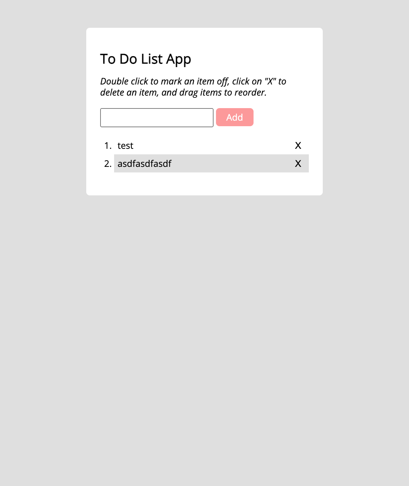

# jquery-todo-app

A small todo application built with jQuery

## Table of contents

- [Overview](#overview)
  - [Screenshot](#screenshot)
  - [Links](#links)
  - [Built with](#built-with)
  - [What I learned](#what-i-learned)
- [Author](#author)

## Overview

The goal for this app was to get a functional todo application using jQuery.

### What it does

Users are able to:

- Add items to the list.
- Re-order items when clicking and dragging.
- Cross off items with a double click.
- Delete items with the X button.

### Screenshots



### Links

- Live Site URL: [Here](https://curtisgry.github.io/jquery-todo-app/)

### Built with

- CSS
- Javascript
- jQuery

### What I learned

During this project I learned about how to make a draggable list item. Very simple with jQuery!

```js
list.sortable();
```

I gained a better understanding of how to use jQuery to build front end UI's

## Author

- Website - [Curtis Gray](https://curtisgry.github.io/portfolio-website/)
